# ATM System by WPI

### About this project

For this task, you are going to implement an ATM system that allows users to manage
their accounts. There are two types of users: Customers and Administrators. Both are
presented with their own menus (after login). Customers can use the system to
withdraw cash, deposit cash, and get their current balance. For simplicity, assume a
customer can have only 1 account (so they can’t have a savings AND checking account
or a Joint account with a spouse, for example). Administrators can view, create,
delete, and update accounts of customers. All data should be stored in a MySQL
database and the program is a console application (not a web app).

<video src="./demo.mp4"></video>

### ATM System Use Case Diagrams

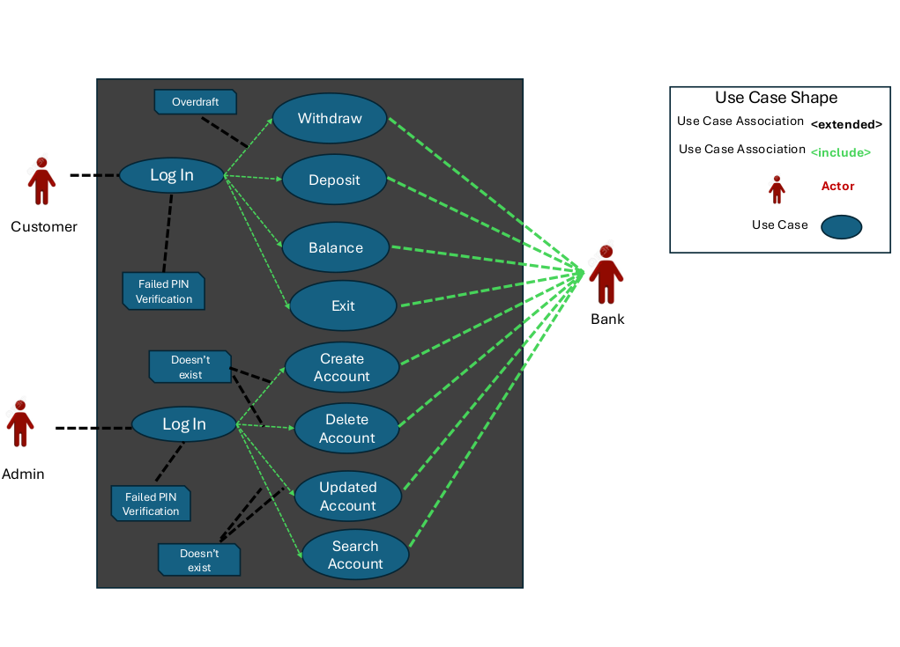

#### ATM ERD

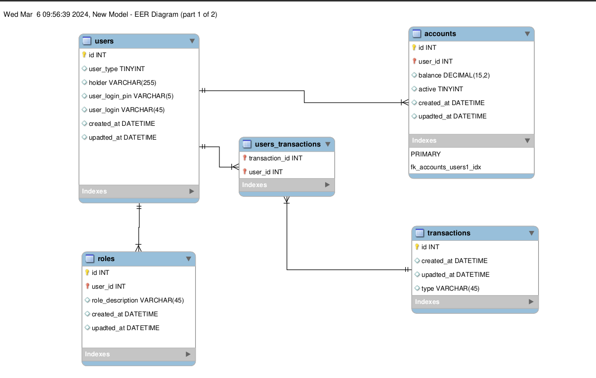

#### Dump file

`db_stuff/atm.sql`

#### Screen Shoots - Admin Menu

- Failed login

  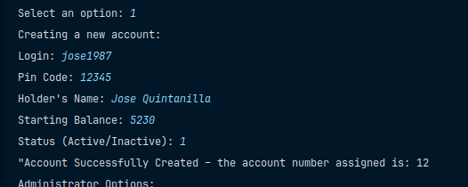

- Log in as admin1, 12345

  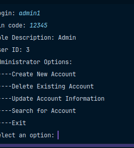

  

- Add new Account 

  

* Update, here we use the user id we just create 19 (not the account number)

  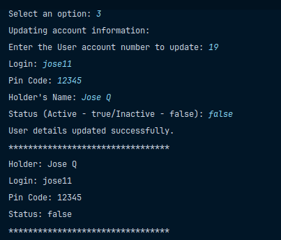

- Delete account, use again 19

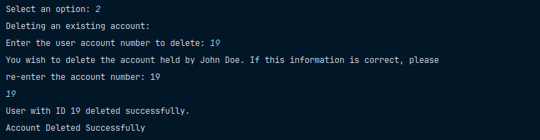

- Exit Admin menu

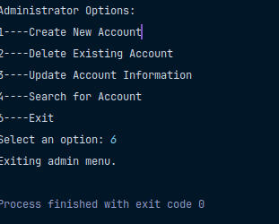

- Search User Id 2

  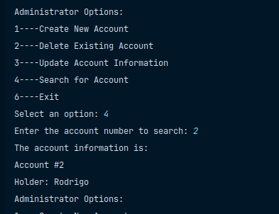

#### Customer Menu (User 2)

- Withdraw

- 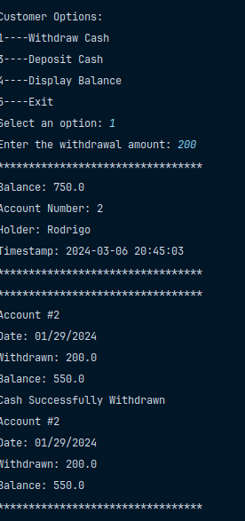

- Deposit

  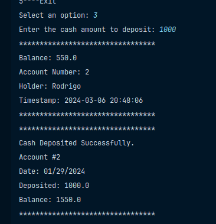

- Get Balance

  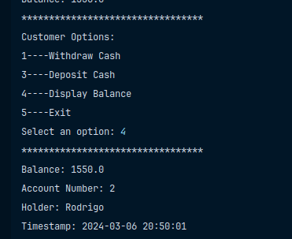

- Exit Customer Menu

  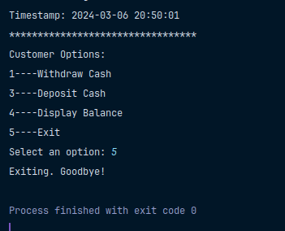